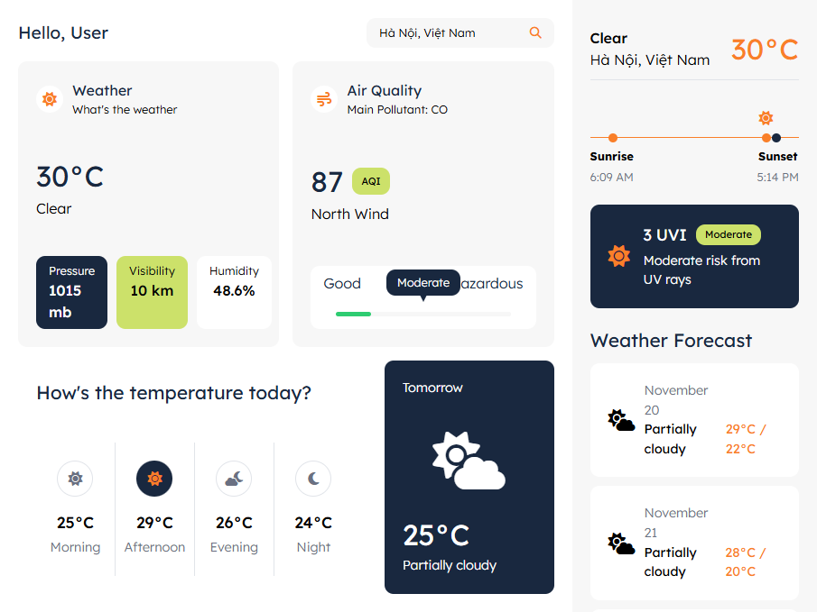

# Odin Weather App

- This app represents a simple weather app which provides weather today's condition and forecast

## Preview

- This is the preview screenshot when user first visit the app

## Features

- User is able to search for location
- When they search for a valid location, render today's condition, sunrise and sunset time, day session temperatures, and forecast for tomorrow and the next 15 days.
- When they search for an invalid location, render a modal to inform them and ask them to search again.

## API

- This app takes data from
  [visual Crossing API](https://www.visualcrossing.com/resources/documentation/weather-api/timeline-weather-api/)
